## Per base sequence content
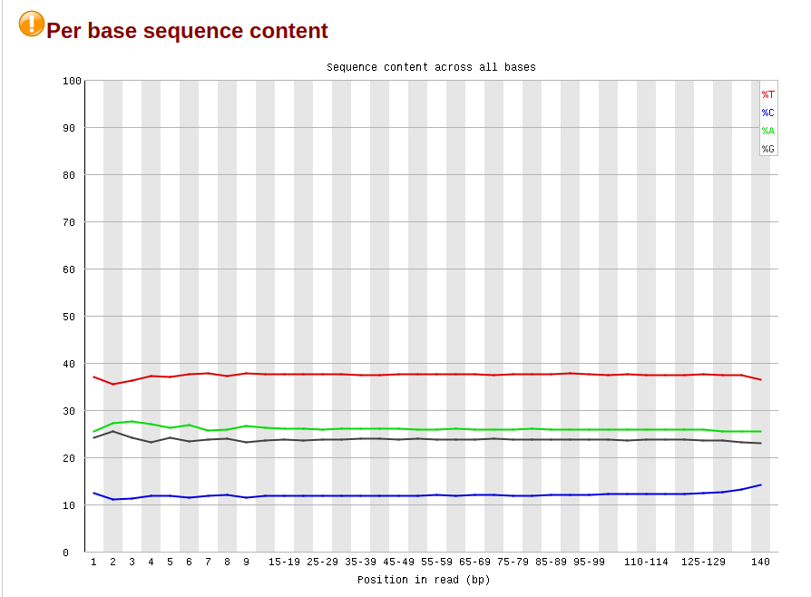
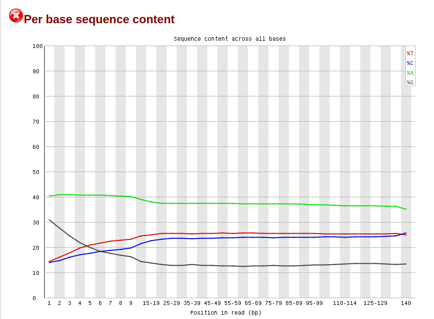
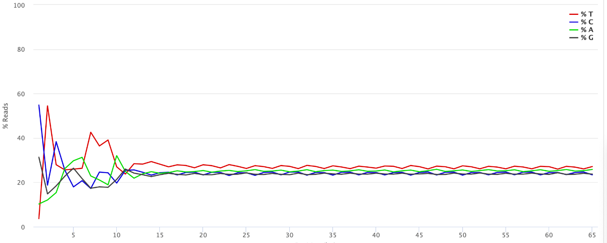

Нетрудно заметить, что графики разные. На первом (SRR5836473_1) повышено содержание тимина, но при этом мало цитозина в отличие от 3 графика (РНК).
На 2 гграфике избыток ацетозина и недостаток гуанина, по сравнению с РНК. Все остальное находится примерно на 1 уровне с рнк.

## Per sequence GC content
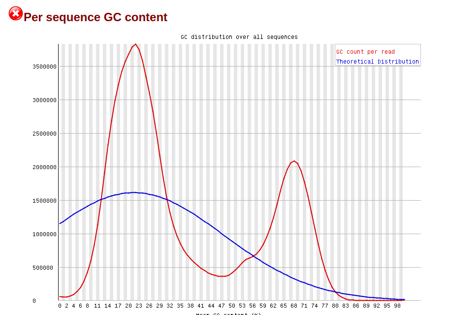
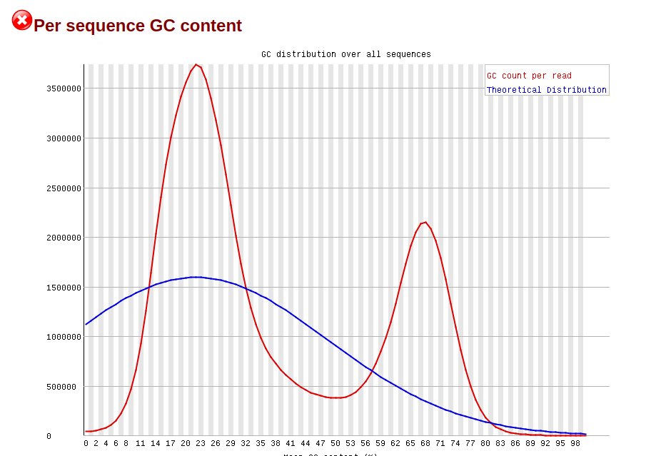
В данном случае графики похожи друг на друга

## Per sequence GC content

## Сводная таблица
В таблице также указан процент дедуплицированных прочтений, для большей наглядности

| Образец     | ch11: 11347700-11367700 | ch11: 40185800-40195800 | deduplication |
|-------------|-------------------------|-------------------------|---------------|
| SRR5836473  | 551                     | 194                     | 81.72         |
| SRR5836475  | 797                     | 274                     | 90.93         |
| SRR3824222  | 1344                    | 565                     | 97.09         |

## Коллинг метилирования цитозинов и M-bias plots

### SRR5836473
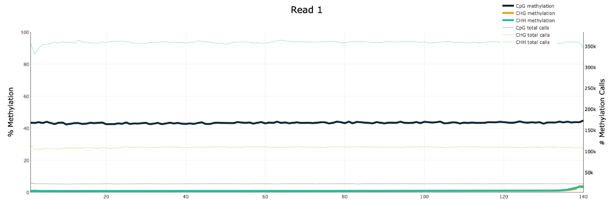
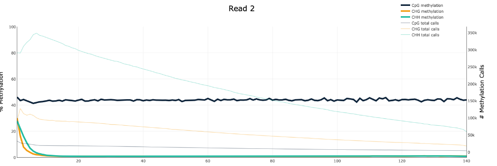
### SRR5836475
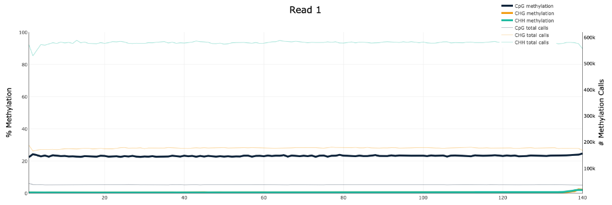
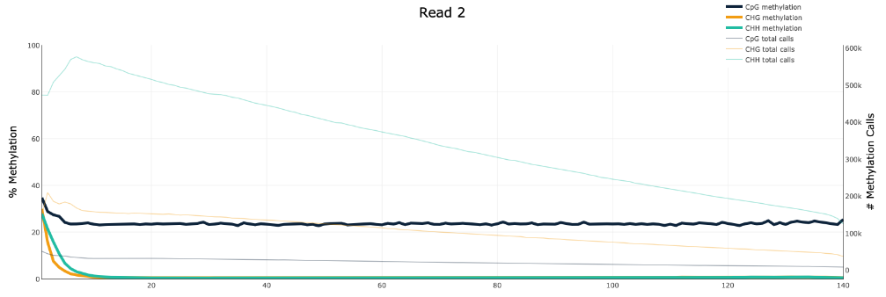
### SRR3824222
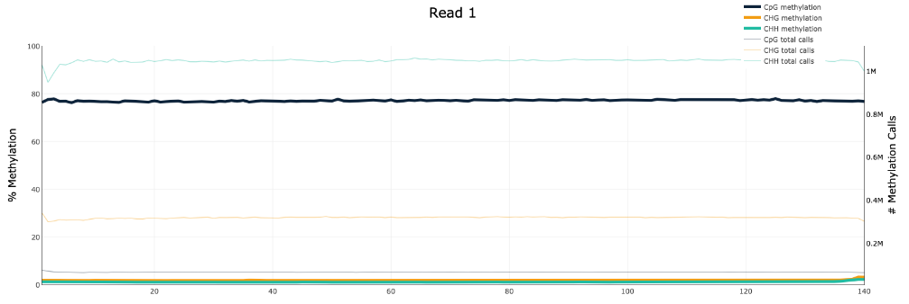
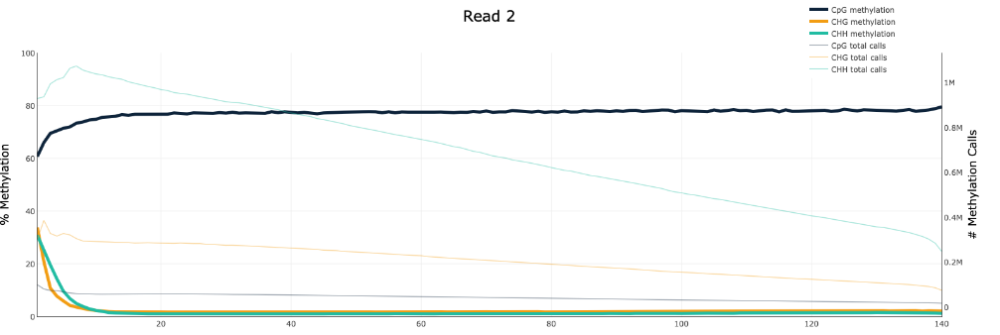

## Гистограммы распределения метилирования цитозинов по хромосоме
### SRR5836473
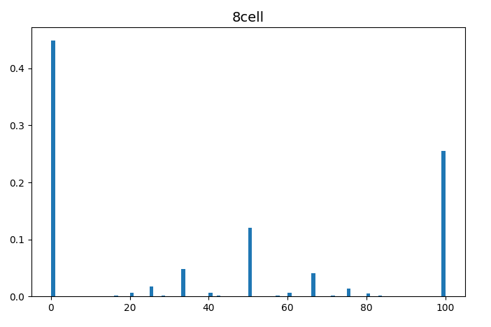
### SRR5836475
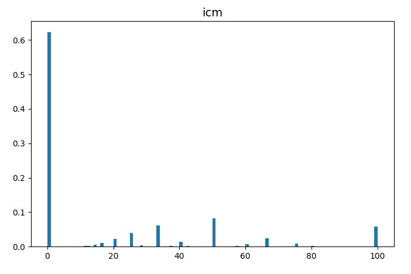
### SRR3824222
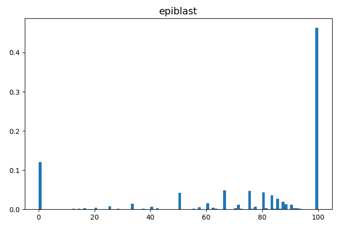

### Анализ
Все 3 образца метилируются по разному. В первом самое частое 0% (более 40% на графике), во втором тоже 0, причем уже более 60 процентов. На третьем самое частое 100% (более 40%), т.е. скорее всего хорошо проходит экспрессия гена.

